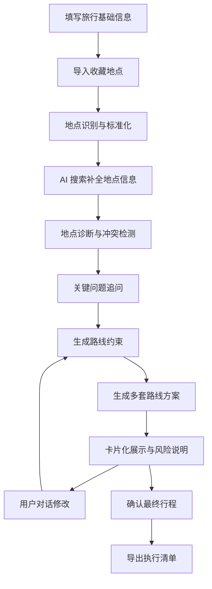

# 智能旅行规划 Agent PRD

## 1. 产品概述

### 1.1 产品名称

智能旅行规划 Agent

### 1.2 产品定位

面向年轻自由行用户的 AI 攻略共创助手，帮助用户把从小红书、抖音、携程等渠道收藏或获取的一堆旅行地点，整理成真实可执行、可解释、可调整的旅行路线。

### 1.3 MVP 核心场景

用户已经收藏了多个想去的地点，但不知道如何筛选、分组、安排顺路路线。产品通过“表单 + 聊天”的方式采集关键信息，识别并补全地点信息，主动诊断不合理安排，生成多套卡片化行程方案，并支持用户继续对话修改。

### 1.4 核心价值

把零散旅行灵感转化为可执行路线，降低年轻自由行用户的信息整理成本、路线规划成本和决策疲劳。

## 2. 产品目标

### 2.1 MVP 目标

验证年轻自由行用户是否愿意将“收藏地点整理与路线生成”交给 AI，并通过对话修改得到一份可实际使用的旅行路线。

### 2.2 成功标准

- 用户能在 10 分钟内从收藏地点生成一份 2-3 天游玩路线。
- 路线方案能保留用户标记的必去地点。
- 路线方案能主动指出明显不合理安排。
- 用户能通过自然语言修改路线，而不需要重新填写完整表单。
- 用户认为最终路线具备可实施性。

## 3. 目标用户

### 3.1 核心用户

20-35 岁年轻自由行用户。

### 3.2 用户特征

- 有自由行意愿，不倾向跟团。
- 常用小红书、抖音、携程获取旅行灵感。
- 会做攻略，但过程疲惫。
- 经常收藏很多地点、笔记、链接或截图。
- 面临信息过载、路线混乱、取舍困难、怕踩坑等问题。

### 3.3 典型用户故事

用户计划和朋友去上海玩 3 天 2 晚，已经在小红书、抖音、携程收藏了 20 个地点，希望拍照、吃美食、不要太累，但不知道哪些地点应该放在同一天，也不知道哪些地点其实体验相似可以取舍。用户希望 AI 帮忙生成 2-3 套路线，并能继续根据自己的想法调整。

## 4. MVP 范围

### 4.1 本期支持

- 支持所有城市。
- 支持用户通过文本、截图、链接导入收藏地点。
- 常用信息源聚焦小红书、抖音、携程。
- 初版采用用户输入 + AI 搜索补全的方式获取地点信息。
- 支持表单采集基础旅行信息。
- 支持 Agent 对模糊输入逐步追问。
- 支持生成 2-3 套路线方案。
- 支持卡片化行程界面。
- 支持对话式修改路线。
- 支持输出最终执行清单。
- 对营业时间、价格、预约信息等不确定数据展示置信状态。

### 4.2 本期不支持

- 不支持机票、酒店、门票真实下单。
- 不支持自动同步用户平台账号收藏。
- 不支持多人协同投票。
- 不支持实时导航。
- 不支持实时价格锁定。
- 不支持复杂签证、保险、跨国合规服务。

### 4.3 后续迭代

- 接入地图 POI 数据。
- 接入实时交通、天气、排队热度。
- 支持日历、地图、PDF、小红书格式导出。
- 支持多人偏好协调。
- 支持预订导流或会员服务。

## 5. 用户使用流程

### 5.1 主流程

1. 用户填写基础旅行信息。
2. 用户导入收藏地点。
3. Agent 识别并标准化地点。
4. Agent 补全地点信息。
5. Agent 诊断地点冲突与路线风险。
6. Agent 对缺失关键信息进行追问。
7. Agent 生成 2-3 套路线方案。
8. 用户查看卡片化行程。
9. 用户通过聊天提出修改。
10. Agent 局部重排并解释变化。
11. 用户确认最终行程。
12. 系统输出执行清单。

### 5.2 工作流图

## 6. 输入需求

### 6.1 基础旅行信息

- 目的地城市。
- 出行日期和天数。
- 到达时间。
- 离开时间。
- 酒店位置，如已确定。
- 同行人数与关系。
- 预算范围。
- 旅行节奏：松弛、适中、高效打卡。
- 交通偏好：公共交通、可打车、自驾。
- 偏好标签：美食、拍照、自然、文化、购物、夜生活。
- 忌讳事项：早起、排队、太累、太贵、跨区太远。

### 6.2 收藏地点输入

支持以下输入方式：

- 手动粘贴地点列表。
- 粘贴从小红书、抖音、携程复制的文本。
- 粘贴小红书、抖音、携程链接。
- 上传截图，由系统识别地点名称。

### 6.3 用户优先级

用户可对地点标记：

- 必去。
- 想去。
- 可选。
- 备选。
- 不想去。

## 7. Agent 追问机制

### 7.1 追问原则

- 每轮最多追问 1-3 个关键问题。
- 优先追问会影响路线可行性的内容。
- 用户可以选择“你帮我判断”。
- 缺失信息可使用默认值，但必须在方案中说明。

### 7.2 必须追问

缺失后无法可靠规划的信息：

- 目的地城市不明确。
- 出行天数缺失。
- 收藏地点无法识别。
- 必去地点之间存在重大时间或距离冲突。
- 到达或离开时间会影响首尾日安排。

### 7.3 建议追问

缺失后仍可规划，但会影响质量的信息：

- 酒店区域。
- 每天出门和结束时间。
- 是否接受打车。
- 旅行节奏。
- 预算范围。
- 是否介意排队。

### 7.4 默认值

用户不确定时，系统可使用以下默认值：

- 默认适中节奏。
- 默认每天 9:30 出门，21:00 前结束。
- 默认公共交通优先，必要时打车。
- 默认每餐预留 1-1.5 小时。
- 默认每天不超过 4 个主要游玩地点。

## 8. 地点标准化与补全

### 8.1 标准化字段

每个地点应尽量补全以下字段：

- 标准名称。
- 地址。
- 坐标。
- 地点类型。
- 营业时间。
- 门票或人均消费。
- 建议游玩时长。
- 适合时段。
- 是否需要预约。
- 预约难度。
- 用户优先级。
- 数据置信状态。

### 8.2 数据置信状态

对营业时间、价格、预约信息等可能变化的信息，必须展示置信状态：

- 已确认：信息来源较明确，近期可信。
- 待确认：信息存在但可能变化。
- 可能变化：价格、营业时间、预约规则高度依赖日期或平台。
- 未获取：当前无法获得可靠信息。

### 8.3 不确定信息处理

- 不允许把不确定信息包装成确定结论。
- 不确定信息必须在地点卡或风险提示中标注。
- 涉及营业时间、预约、价格的关键事项，应提示用户出发前二次确认。

## 9. 路线生成规则

### 9.1 总原则

用户需求优先，真实可执行优先。Agent 可以建议取舍，但不能擅自删除用户标记为必去的地点。

### 9.2 规划优先级

1. 保留用户必去地点。
2. 检查必去地点之间的重大冲突。
3. 按地理位置进行区域聚类。
4. 按营业时间和适合时段筛选可安排窗口。
5. 结合交通耗时安排地点顺序。
6. 插入餐饮、休息和交通缓冲。
7. 根据用户节奏控制每日强度。
8. 对相似地点提出合并或取舍建议。
9. 将低优先级或冲突地点放入备选。
10. 输出规划理由与风险提醒。

### 9.3 必去地点规则

- 用户标记为必去的地点默认必须纳入路线。
- 如果必去地点导致路线过满、绕路、超预算或营业时间冲突，Agent 必须提示用户确认。
- 如果用户坚持保留全部必去地点，Agent 应生成可执行的高强度方案，并明确说明代价。

### 9.4 相似地点规则

- 当多个地点体验高度相似时，Agent 应主动说明相似性。
- Agent 可以建议保留其中更顺路、更符合偏好或性价比更高的地点。
- Agent 不能在未确认的情况下删除用户标记为必去的相似地点。
- 如果用户坚持都去，Agent 应尽量安排在同一区域或相邻时间段，减少绕路。

### 9.5 距离与交通规则

- 不只依据直线距离，应尽量依据真实交通耗时。
- 避免同一天频繁跨区往返。
- 夜间安排应考虑返程便利性。
- 如果某地点偏远，应说明交通成本和时间成本。

### 9.6 营业时间与价格规则

- 闭馆、休息日、营业时间冲突必须提示。
- 门票或高消费地点应在预算中体现。
- 预约制景点、热门餐厅、演出必须标记预约风险。
- 信息不确定时必须显示置信状态。

### 9.7 不合理安排处理

当 Agent 发现不合理安排时：

- 轻微问题直接优化，并在方案说明中解释优化原因。
- 重大冲突必须让用户确认后再处理。

轻微问题包括：

- 同一区域内地点顺序不佳。
- 餐饮时间略不合理。
- 可通过调整先后顺序解决的小幅绕路。
- 可通过替换同类型备选解决的小幅超载。

重大冲突包括：

- 必去地点无法在营业时间内完成。
- 用户要求保留的地点跨区过远，导致当天严重超载。
- 预算明显超出用户范围。
- 首尾日时间不足以完成用户要求。
- 用户要求与预约、闭馆、交通条件发生冲突。

## 10. 路线方案输出

### 10.1 方案类型

默认输出 2-3 套方案：

- 路线最顺版：优先减少绕路，适合大多数用户。
- 松弛体验版：减少点位，增加停留和休息时间。
- 高效打卡版：保留更多收藏地点，但明确标注强度较高。

### 10.2 每套方案内容

- 方案名称。
- 适合人群。
- 每日主题。
- 上午、下午、晚上安排。
- 地点顺序。
- 交通建议。
- 预计游玩时间。
- 当日强度。
- 预算粗估。
- 预约和营业时间提醒。
- 被放入备选的地点。
- 规划理由。
- 风险提示。

### 10.3 地点卡内容

- 地点名称。
- 地点类型。
- 建议到达时间。
- 建议停留时间。
- 营业时间。
- 价格或人均消费。
- 是否需要预约。
- 与上一地点交通建议。
- 数据置信状态。
- 注意事项。

### 10.4 风险提示卡

风险提示卡用于展示：

- 闭馆或营业时间风险。
- 预约风险。
- 路线过满。
- 跨区过远。
- 同质化地点较多。
- 预算超出。
- 天气或季节影响。
- 信息待确认。

## 11. 聊天修改能力

### 11.1 支持修改意图

用户可以通过自然语言修改路线，例如：

- 第二天太累了。
- 这个餐厅换便宜点。
- 两个海边景点都想去。
- 不想早起。
- 多留一点拍照时间。
- 把商场删掉。
- 下雨怎么办。
- 第一天下午才到，重新安排。

### 11.2 修改原则

- 优先局部重排，不完全推翻已有方案。
- 保留用户已确认的必去地点。
- 修改后说明改了什么。
- 修改后说明对时间、预算、强度的影响。
- 如修改触发重大冲突，必须再次让用户确认。

## 12. 页面与交互需求

### 12.1 页面结构

MVP 建议包含以下区域：

- 基础信息表单。
- 收藏地点导入区。
- Agent 追问区。
- 路线方案卡片区。
- 每日行程卡片。
- 地点卡片。
- 风险提示卡片。
- 备选地点区。
- 聊天修改区。
- 最终行程导出区。

### 12.2 视觉原则

- 卡片化展示，但不花哨。
- 信息层级清晰，便于快速扫描。
- 避免复杂装饰和营销式页面。
- 强调路线可执行性，而不是视觉炫技。
- 重点突出地点顺序、时间、交通、风险和理由。

### 12.3 关键交互

- 用户可标记地点优先级。
- 用户可展开查看地点详情。
- 用户可查看某个地点为什么被安排或放入备选。
- 用户可一键要求 Agent 调整方案。
- 用户可确认某套方案作为最终行程。
- 用户可复制或导出执行清单。

## 13. 数据需求

### 13.1 必需数据

- 地点名称。
- 地址和坐标。
- 地点类型。
- 营业时间。
- 门票或消费水平。
- 建议游玩时长。
- 交通耗时。
- 是否需要预约。

### 13.2 可选数据

- 热门时段。
- 排队风险。
- 天气。
- 季节适宜性。
- 用户评价摘要。
- 同类型地点相似度。

### 13.3 数据策略

MVP 阶段采用用户输入 + AI 搜索补全。后续根据验证结果接入地图 POI、实时交通、天气和平台数据。

## 14. 验收标准

### 14.1 功能验收

- 用户可完成基础信息填写。
- 用户可导入文本、截图、链接形式的地点信息。
- 系统可识别地点并生成结构化地点列表。
- 系统可对模糊输入进行追问。
- 系统可生成 2-3 套路线方案。
- 系统可保留用户必去地点。
- 系统可识别并提示重大冲突。
- 系统可对轻微问题直接优化。
- 系统可展示营业时间、价格、预约信息的置信状态。
- 用户可通过聊天修改路线。
- 系统可输出最终执行清单。

### 14.2 体验验收

- 用户能理解每个地点为什么这样安排。
- 用户能看懂哪些地点被保留、取舍或放入备选。
- 用户能看懂路线强度和风险。
- 用户无需反复重新输入基础信息。
- 卡片界面清晰克制，不影响信息阅读。

### 14.3 质量验收

- 路线不应出现明显跨区反复绕路。
- 营业时间冲突必须被识别并提示。
- 明显过满的行程必须提示强度风险。
- 不确定信息必须标注置信状态。
- 必去地点被移除前必须经过用户确认。

## 15. 成功指标

### 15.1 核心指标

- 路线生成完成率。
- 用户确认最终行程比例。
- 用户二次修改率。
- 用户对路线可执行性的评分。
- 用户从输入到获得可用路线的平均耗时。

### 15.2 MVP 目标指标

- 70% 用户能在 10 分钟内得到一份可用路线。
- 60% 用户愿意继续通过聊天修改路线。
- 50% 用户最终确认某套路线作为执行方案。
- 路线可执行性评分达到 4/5 以上。

## 16. 风险与兜底

### 16.1 主要风险

- AI 搜索补全信息不准确。
- 营业时间、价格、预约规则变化。
- 部分城市 POI 信息不足。
- 截图或链接解析失败。
- 用户输入地点名称模糊。
- 路线生成看似合理但实际交通不顺。

### 16.2 兜底策略

- 关键信息展示置信状态。
- 对待确认信息主动提示用户核实。
- 对重大冲突要求用户确认。
- 对解析失败地点要求用户补充。
- 提供备选地点和备选路线。
- 对高强度方案明确标注代价。

## 17. 后续迭代方向

- 接入地图 POI 和真实路线规划能力。
- 支持用户导入地图收藏。
- 支持多人旅行偏好协调。
- 支持实时天气和交通重排。
- 支持预约提醒。
- 支持旅行中陪伴模式。
- 支持商业化导流和会员服务。

